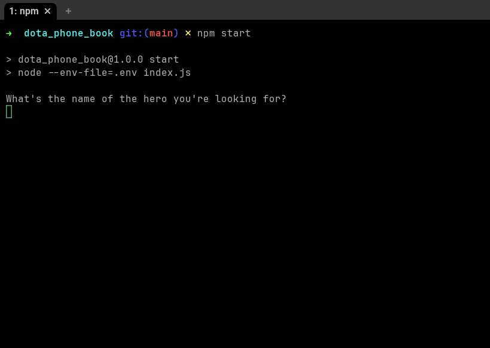
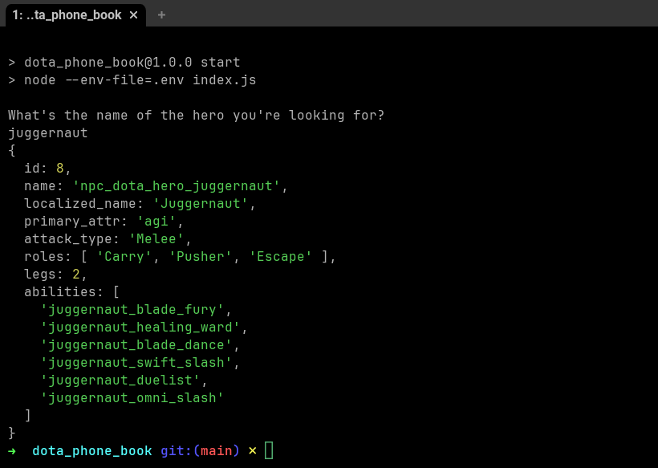

# Dota Phone Book

## Overview

Dota Phone Book is a command-line interface tool that allows users to query and retrieve information about the heroes from the game Dota 2.

## Features

- Query heroes by name
- Display primary attribute type, attack type and abilities of a specific hero

## Usage

To use the Dota Phone Book cli, you need to have node installed on your system.

```bash
npm start
```




